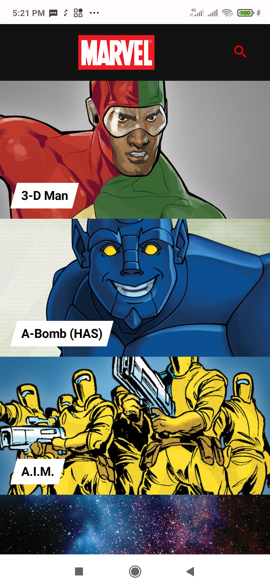
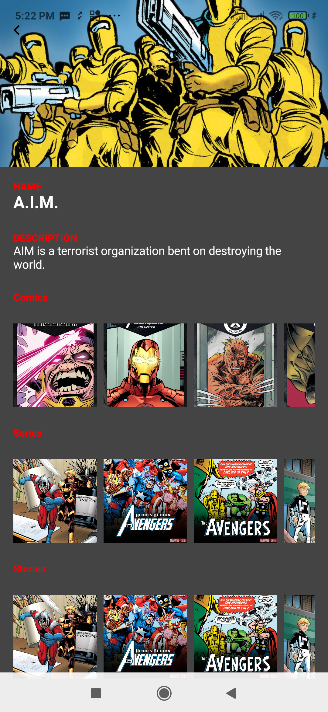
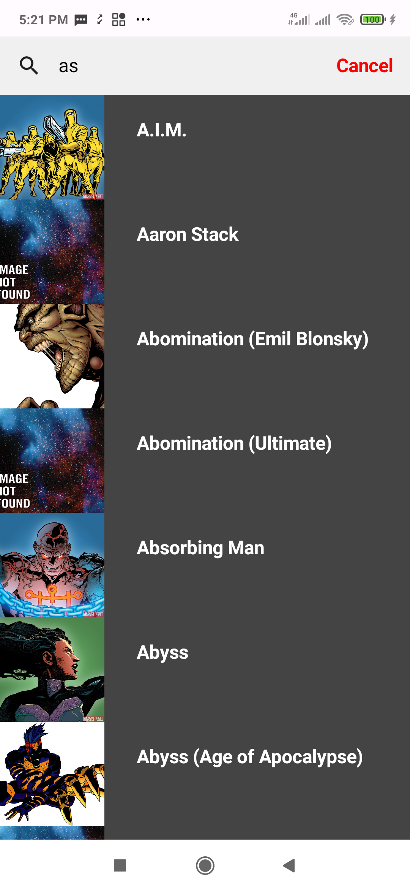

# Marvel Task

An Android app that displaying marvel characters.

# Application version
[you can download the apk from here](https://i.diawi.com/dyKogR) -------
[find it also on google drive ](https://drive.google.com/file/d/1kQyE7TCC94g34tykkPqzw-XSHc61pDUo/view?usp=sharing)

In addition, the project:
* displaying **Marvel Details** with its comics, series, events stories.
* enabling **Search** to help the user to search for his Marvel Favorite Character.

# Screenshots

# Used Technologies
* kotlin
* co-routines
* retrofit
* mvi
* jetpack compose 
* clean architecture
* pagination